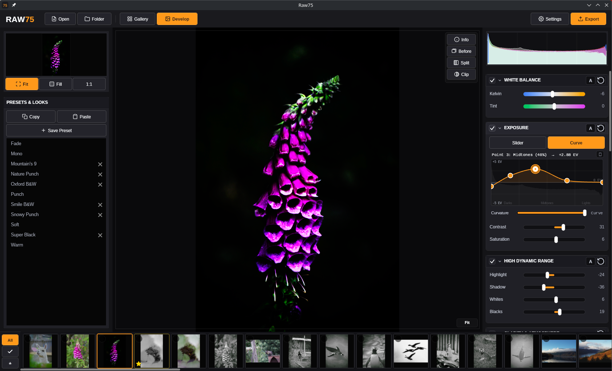

# Raw75



A fast, modern desktop application for editing RAW photos. Free and open-source software under the AGPL-3.0 license.

UI is built with [Blossom](https://github.com/cretucosmin3/Blossom), with real-time hardware-accelerated photo development rendered via Skia and SkSL shaders on the GPU.

---

## Features

### Tone & Dynamic Range
- **Exposure & Brightness**: Fine-grained exposure correction with real-time preview.
- **Dynamic Tone Controls**: Highlights, Shadows, Whites, and Blacks with smooth perceptual rolloff.
- **Sigmoid Tone Mapping**: Smooth highlight roll-off and shadow preservation.
- **Dehaze & Atmosphere**: Single-image airlight estimator and physical atmospheric transmission recovery.
- **Tone & Color Curves**: Interactive 4-channel curves editor (RGB, Red, Green, Blue) using monotone cubic Hermite spline interpolation.
- **Real-Time Histogram**: RGB and luminance histogram with active clipping indicators.

### Color & Grading
- **White Balance & Tint**: High-precision Kelvin temperature and green-magenta tint balancing.
- **Vibrance & Saturation**: Perceptual saturation enhancement with skin tone protection.
- **HSL Tool**: 6-color band editor for custom Hue, Saturation, and Lightness adjustments.
- **3D LUT Support**: Load `.cube` LUT profiles directly into the GPU shader pipeline.

### Detail & Reconstruction
- **Local Contrast**: Edge-preserving bilateral filtering for micro-contrast enhancement.
- **Sharpening & Denoise**: Fine detail extraction with customizable noise reduction.
- **Highlight Reconstruction**: Recovers blown highlight areas using opposed-channel and chromaticity transfer techniques.

### Canvas & Workflow
- **Gallery & Workspace**: Fast folder browsing with background caching and non-destructive recipe storage.
- **Photo Canvas**: Smooth zoom & pan, 1:1 pixel inspection, and center-fit.
- **Before / After**: Instant side-by-side and split-view preview modes.
- **Crop & Geometry**: Interactive on-canvas crop handles, straighten angle adjustment, 90° rotation, and flips.
- **Presets**: Built-in and custom presets stored as lightweight non-destructive JSON recipes.
- **Export**: Full-resolution rendering to JPEG (with original EXIF metadata preserved), PNG, WebP, and TIFF.

---

## Installation & Releases

Self-contained binaries are built automatically for:
- **Linux** (`x64`)
- **Windows** (`x64`)
- **macOS** (Apple Silicon `arm64` & Intel `x64`)

Download the latest release archive for your platform from the [Releases](https://github.com/cretucosmin3/Raw75/releases) tab.

---

## Building from Source

### Prerequisites
- [.NET 10 SDK](https://dotnet.microsoft.com/download)

### Clone & Run
```bash
git clone --recurse-submodules https://github.com/cretucosmin3/Raw75.git
cd Raw75
dotnet run --project src/Raw75/Raw75.csproj
```

### Self-Contained Release Build
```bash
dotnet publish src/Raw75/Raw75.csproj -c Release -r <RID> --self-contained true
```
*(Replace `<RID>` with `linux-x64`, `win-x64`, `osx-arm64`, or `osx-x64`)*

---

## License

Copyright (C) 2026 Cosmin Crețu

This program is free software: you can redistribute it and/or modify it under the terms of the GNU Affero General Public License as published by the Free Software Foundation, either version 3 of the License, or (at your option) any later version. See `LICENSE` for details.
